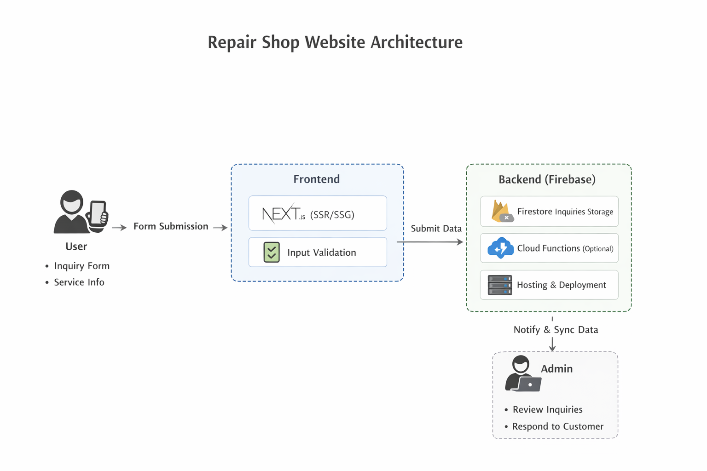

# Repair Shop Website (Client Project)

A production website built for a local phone repair business to improve online presence and streamline customer inquiries.

> ⚠️ Note: This is a sanitized case study. Source code and business-specific details are private.

---

## 🚀 Overview

This project focused on delivering a **lightweight, high-performance website** for a repair shop with two primary goals:

- improve customer acquisition through SEO and accessibility  
- simplify customer inquiry flow for repair services  

The solution was designed to be simple, scalable, and easy to maintain.

---

## 🧩 Key Features

- Service catalog (e.g. screen repair, battery replacement, diagnostics)  
- Customer inquiry form with backend storage  
- Business information (location, hours, contact details)  
- Fully responsive layout (mobile-first)  
- SEO-optimized structure using Next.js  

---

## 🏗️ System Architecture

### Frontend
- Next.js (SSR / SSG for performance and SEO)  
- Component-based UI for maintainability  

### Backend (Firebase)
- Firestore: stores customer inquiries  
- Cloud Functions (optional): validation / processing  
- Hosting: production deployment  

### Data Flow

1. User submits inquiry form  
2. Client validates input (required fields)  
3. Data is sent to Firestore  
4. Business reviews and responds manually  

---

<h2>🏗️ System Architecture</h2>

  

---

## 🔄 Core Workflow: Customer Inquiry

1. Customer selects service type  
2. Enters device details and issue description  
3. Provides contact information  
4. Form submission is validated and stored  
5. Business receives and processes inquiry  

---

## ⚙️ Key Technical Decisions

### Why Next.js
- SEO is critical for local business discovery  
- SSR improves search engine indexing vs SPA  

### Why Firebase
- minimal backend setup and maintenance  
- fast deployment cycle  
- suitable for small-scale data workflows  

### Trade-offs
- No admin dashboard (kept scope lean)  
- Limited automation in inquiry handling  
- Not designed for large-scale multi-branch systems  

---

## 🧠 Challenges & Solutions

**Challenge:** balancing simplicity vs scalability  
→ Designed Firestore structure to allow future extension  

**Challenge:** mobile-first traffic  
→ Implemented responsive layout optimized for smaller screens  

---

## 🎯 Outcome

- Delivered a production-ready website for a real business  
- Improved online visibility and accessibility  
- Created a foundation for future features (e.g. booking system, admin panel)  

---

## 👤 My Role

- gathered requirements directly from client  
- designed user flow and layout  
- implemented frontend and backend integration  
- deployed and configured production environment  

---

## 🔒 Notes

- Business details are generalized for privacy  
- No sensitive data or proprietary logic is included  
